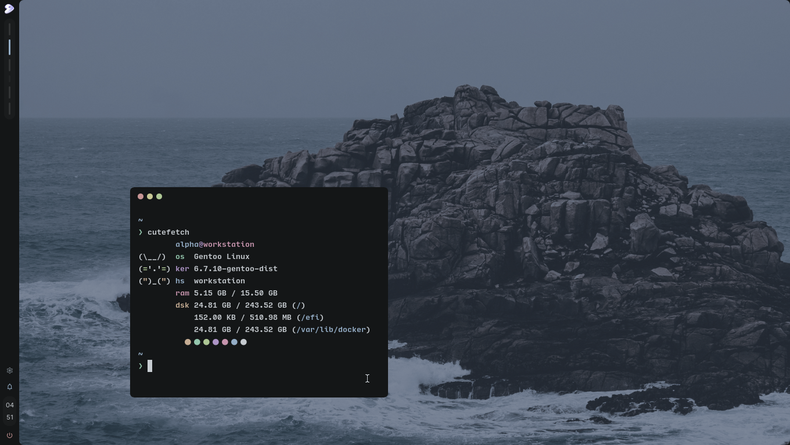

# AwesomeWM config

A new incoming AwesomeWM which is being daily driven at a Gentoo installation.

> Incoming to be merged at [dotfiles](https://github.com/AlphaTechnolog/dotfiles)

> Note that it should also work on others distros if you install the packages for your distro

## Preview



> Last preview was updated at 29/02/24, note that it may be outdated...

## Requirements

Check your package manager instructions in order to be able to install these packages
appropiately

> Some packages may be missing... report the missing ones at issues if needed please :grin:

### Packages

- vorbis
- libnotify
- wget
- curl
- awesomewm git (not the stable one!)

## Fonts

- Inter
- [Material Symbols](https://github.com/google/material-design-icons/tree/master/variablefont)

## Installation

To install just execute the next command

> Note that these may be outdated, this will be improved when merged to [dotfiles](https://github.com/alphatechnolog/dotfiles).

```sh
git clone https://github.com/alphatechnolog/awesomewm-config ~/.config/awesome \
    --recurse-submodules \
    --depth=1
```

Then just restart AwesomeWM

## Planned features ATM

Some of the planned features at the moment are:

- [x] Bar
- [x] Wallpaper Manager
  - [x] Colour wallpaper
  - [x] Image wallpaper
  - [x] Tiled wallpaper
- [x] Base configuration
  - [x] Keybindings
  - [x] Client rules
  - ...
- [x] Titlebars (though it kinda needs to be improved)
- [x] Notifications
  - [x] Popup
  - [x] Sound
  - [ ] Panel
    - [ ] Regular notifications
    - [x] GitHub notifications (50% tho)
- [ ] Powermenu
- [ ] Settings/Dashboard main popup
  - [x] Animations
  - [x] Dialog
  - [x] Tabs
    - [x] Layout
    - [x] Animations
    - [x] Define links
  - [ ] Home
  - [ ] Tasks (Main layout is mostly done tho)
    - [x] List tasks
    - [ ] Edit tasks
    - [ ] Update tasks
    - [ ] Search tasks
    - [ ] Create tasks
  - [ ] Notes
  - [x] Youtube Manager (checking possibility to ship at v1)
    - [x] Coming soon splash
  - [ ] About the system

> Maybe there're more features but i did forget lmao
